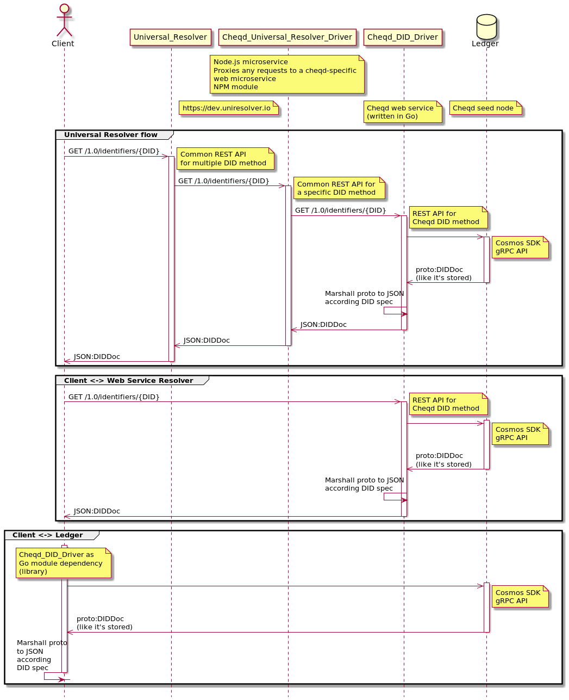
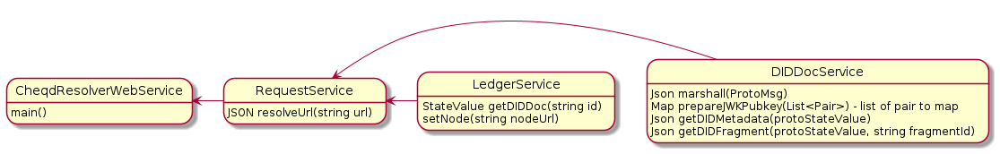

# ADR 010: DID Resolver

## Status

| Category | Status |
| :--- | :--- |
| **Authors** | Renata Toktar|
| **ADR Stage** | DRAFT |
| **Implementation Status** | Not Implemented |
| **Start Date** | 22 February 2022 |

## Summary

This document defines the architecture of two DID resolvers: 

- A cheqd DID Resolver, as a module written in Go, or a standalone web service (the goal of which is to generate a spec compliant DIDDoc, based on the [cheqd DID method](adr-002-cheqd-did-method.md)), and
- A [Universal Resolver Driver](https://github.com/decentralized-identity/universal-resolver) (the goal of this, as a microservice, is to relay requests to the above DID resolver, and to provide greater accessibility to third parties resolving cheqd DIDs). 

## Context

DID resolution functions resolve a DID into a DID document by using the "Read" operation of the applicable DID method, in our case, the [cheqd DID method](adr-002-cheqd-did-method.md).

All conforming DID resolvers implement the functions below, which have the following abstract forms:

    resolve(did, resolutionOptions) → 
    « didResolutionMetadata, didDocument, didDocumentMetadata »

    resolveRepresentation(did, resolutionOptions) → 
    « didResolutionMetadata, didDocumentStream, didDocumentMetadata »
    
These two functions enable:

- **Resolve function**: resolution of a DID to a [map](https://www.w3.org/TR/did-core/#did-resolution), with the relevant DID Document, DID Document Metadata and DID Resolution Metadata populated;
- **resolveRepresentation function**: the resolution of a byte stream format of a DID (in say JSON, JSON-LD or CBOR) back into the [map](https://www.w3.org/TR/did-core/#did-resolution) structure. 

Owing to the use of the Cosmos SDK and Cosmos ecosystem, on which cheqd has been built, data written to the ledger uses the serialisation method Google Protocol Buffers (protobuf). Therefore, in order to conform with the correct syntax and structure for the map produced after resolution, cheqd's DID Resolver must implement a resolveRepresentation function that is able to take output in protobuf and convert it into a corresponding, conformant map in JSON, according to the DID core specification. 

This ADR will define the relevant architecture to achieve this through the use of the gRPC endpoint in the Cosmos SDK. 

### General cleanup and QoL changes

Inconsistencies between DIDDoc from the ledger and specification that should be corrected:

1. Rename "context" to "@context" - will be done on the ledger side
2. Change snake_case to camelCase for field names - will be done on Cheqd resolver side using the marshaller setting
3. Remove empty lists  - will be done on Cheqd resolver side using the marshaller setting
4. Convert a list of pairs to a map for jwk_pubkey and other cases
5. In metadata make `did` property to be of `DID` type instead of `Any`
6. DID URL Dereferencing: handle links to provide DID fragments and convert them to the desired format - Cheqd DID resolver functionality.

### Design principles

 helping to define its architecture in detail:

- Parallel executing of requests
- Synchronous replying for client requests (?)
- Marshal/unmarshal JSON - object - protobuff
- Programming language: Go (?)

## Overall Architecture of DID Resolver(s)

### cheqd DID Resolver + Universal Resolver Driver

This overall DID resolver architecture is intended to be decoupled from the cheqd on-ledger services, as an additional resource service, meaning updates to the resolver module do not need an on-chain upgrade. 

It therefore, has multiple components, of which, are flexible and can be implemented in different ways:
- A cheqd Resolver (implemented either as a Library (go module) or as a standalone web service);
- A Universal Resolver Driver that acts as a proxy and relay service to the above cheqd Resolver

This is detailed by the following flow:


[Cheqd did sequence diagram. Schema 1.](assets/adr-010-did-resolver/universal-resolver-sequence-diagram.puml)

Cheqd DIDDoc resolving module at this stage will implement simple functionality that can be a lightweight architecture of threads without synchronization. Just several classes without the use of complex design patterns.


[Cheqd did resolver class diagram](assets/adr-010-did-resolver/resolver-class-diagram.puml)

## cheqd DID resolver

There are two ways to use the cheqd Resolver to return compliant DID Documents: 
- As a library (go module), and
- As a standalone web service.

#### Library (go module)
- In the first case, the module can be imported simply by adding the necessary import:

```golang
import (
     "github.com/cheqd/cheqd-did-resolver/src"
)
```
#### Standalone Web Service

- In the second case, by launching the application with the command.

```bash
go run cheqd_resolver_web_service.go
```

#### Pros

- Updating the resolver software does not need updating the application on the node side
- This avoids having to go through an on-ledger governance vote, and voting period to make a change
- Separation of the system into microservices, which provides more flexibility to third parties in how they choose to resolve cheqd DIDs

#### Cons

For using the resolver separately from the ledger as an additional resolution service. 
All options for application interaction will be described in more detail below in [Possible flows for DID resolution](#possible-flows-for-did-resolution).

- Longer chain of trust. As a result, more resources required by the client to maintain the security of the system (`node + resolver` instead of `node`)

## Universal Resolver Driver

A **Universal Resolver Driver** is not an essential component of the architecture, it functions as an additional service, since the **cheqd Resolver** will be able to implement all the base needs of Universal resolver. In case of unexpected issues with its integration, the cheqd-did-resolver module can always be used to import as a library.

As a library, this would enable the resolver to be inserted into cheqd-node as a new module or as a new handler (keeper), as part of the node application.

#### Pros

The presentation of the data takes place next to the base where the data is stored. This

- speeds up the process due to because of unnecessary data transferring between services
- does not allow compromising the resolver, only the entire node, which is a more difficult task
- fault tolerance and availability of the blockchain network is higher than a single web server

#### Cons

- Unable to update resolver without updating node. However, expanding the functionality without breaking changes is also possible with minor releases, which allows update the node without upgrade transaction.

### Possible flows for DID resolution

To level out downsides of this approach a client can choose one of suitable flows.

#### 1. Universal resolver on DIF side

DIF company has an experimental setup of Universal Resolver on the https://dev.uniresolver.io
The first "Universal Resolver" section from the [schema 1](#did-resolution-from-the-cheqd-network-ledger) shows this flow.
- A client just sends a request to https://dev.uniresolver.io. 
- Universal Resolver on DIF servers uses Cheqd Universal Resolver Driver to redirect client request to Cheqd DID Resolver.
- Cheqd DID Resolver gets DID Doc in protobuf format from the ledger throw Cosmos SDK gRPC API
- Cheqd DID Resolver generates an answer for the client request based on received DID Doc.
- And sends a response to the client throw Cheqd Universal Resolver Driver and Universal Resolver

##### Pros

- Development can be started without additional library dependencies and setting up additional services.

##### Cons

- https://dev.uniresolver.io can be used only for development, can't be use in production goals.
- The longest trust chain where the client must trust all sides

#### 2. Universal resolver on a client side

Absolutely the same with [Universal resolver on DIF side flow](#1-universal-resolver-on-dif-side). 
But the client sets up Universal Resolver with Drivers by themselves.

##### Pros

- Can be used in production
- Trust DIF servers is not needed

##### Cons

- Setting up Universal Resolver and Drivers are needed
- The trust chain where the client must trust all sides, but smaller ten in previous case.


**Note.** We don't consider an option Universal Resolver + Cheqd Resolver on the client side without setting up Cheqd Node
because it has the same set of upsides with this option but more downsides: new additional setup is needed.

#### 3. Universal resolver + Cheqd resolver + Cheqd Node on a client side

The same with a previous case - [Universal resolver on a client side](#2-universal-resolver-on-a-client-side). 
But the client sets up 
- Universal Resolver,
- Universal Resolver Drivers,
- Cheqd resolver web service,
- Cheqd node.

##### Pros

- Maximum Trust Combination.

##### Cons

- Setting up too many services are needed


#### 4. Using third party Cheqd resolver web service directly 

Cheqd provide its own web service with a DID resolver. If a client doesn't need in Universal Resolver then requests can 
be sent directly to Cheqd Resolver Web Servise. 
This flow is demonstrated in the second "Client <-> Web Service Resolver" section from the [schema 1](#did-resolution-from-the-cheqd-network-ledger) shows this flow.
- A client sends a request to Cheqd DID Resolver web service.
- Cheqd DID Resolver gets DID Doc in protobuf format from the ledger throw Cosmos SDK gRPC API
- Cheqd DID Resolver generates and sends an answer for the client request based on received DID Doc.

##### Pros

- The shorter trust chain where the client must trust only Cheqd web service and Cheqd Node

##### Cons

- No Universal Resolver with other DID methods
- Still non-empty trust chain


## Decision

Add a new application/library for did-resolution

## Consequences

### Backwards Compatibility

> All ADRs that introduce backwards incompatibilities must include a section describing these incompatibilities and their severity. The ADR must explain how the author proposes to deal with these incompatibilities. ADR submissions without a sufficient backwards compatibility treatise may be rejected outright.

### Positive

{positive consequences}

### Negative

{negative consequences}

### Neutral

{neutral consequences}

## References

- [W3C Decentralized Identifiers (DIDs)](https://www.w3.org/TR/did-core/) specification
  - [DID Core Specification Test Suite](https://w3c.github.io/did-test-suite/)

## Unresolved questions

- Should the web service find another node for the request if it is not possible to connect to the node? So will the web service have a pool of trusted nodes for requesting?
- Synchronous replying for client requests?
