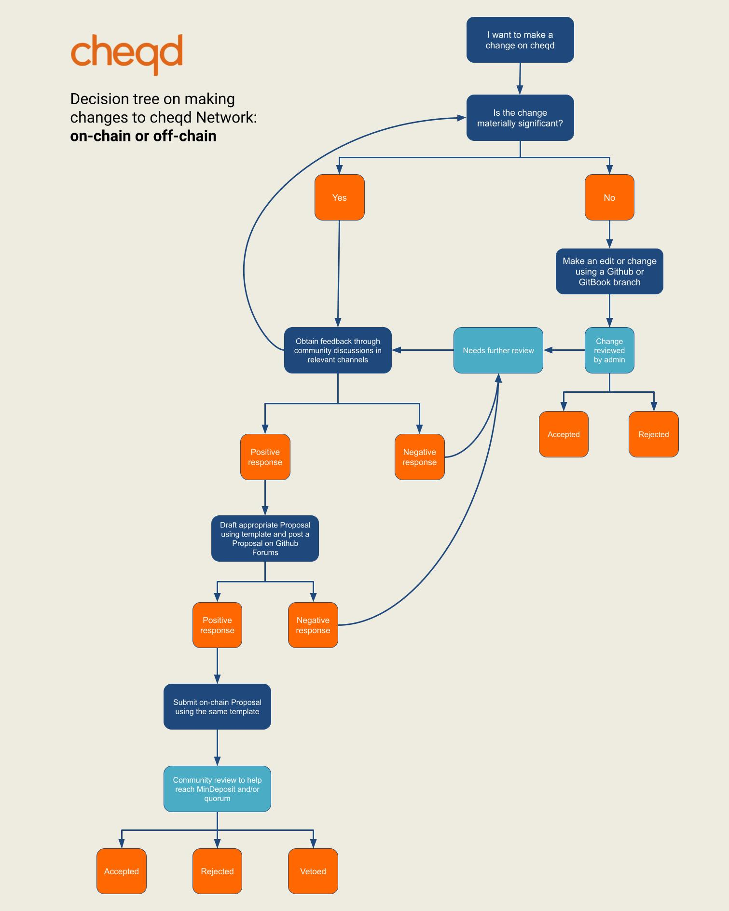

# Major Network changes

## Major Network changes 

These are changes that have a materially significant effect on the Network. Such changes SHOULD be made via a Proposal, following the steps in the decision tree diagram below. 

Major Network changes include, but are not limited to:

* Materially significant Architecture Decisions \(**ADs**\), such as:
  * An additional feature to cheqd;
  * Removal of a feature of cheqd;
* Parameter changes for the Network;
* Community pool decisions;
* Materially significant changes to a cheqd Principle;
* Partnerships or connections to other infrastructure.

## Decision Tree

To help YOU understand how to make changes on the cheqd Network, the decision tree below visualises how changes should be carried out.



## Proposals

One of the most important questions in this Governance Framework is explaining how any token holder can make a proposal or voice their opinion on the Network. 

There are two ways of doing this: 

1. **Informal ‘off-chain’ proposal**
2. **Formal ‘on-chain’ proposal’**

These will be discussed in turn.

## Informal off-chain proposal

Rather than making a proposal directly to the Network, proposals SHOULD first be made off-chain. Off-chain governance is vital for building a healthy and active governance community.

Once feedback has been given in an off-chain forum, the User proposing the Proposal can have more confidence that a Proposal will reach minimum deposit and be approved on-chain. 

### Your Idea

Before you make a Network Proposal, you should engage people \(ideally experts\) informally about your idea. You should consider:

* Does it make sense?
* Are there critical flaws?
* Does it need to be reconsidered?

Governance proposals potentially impact many stakeholders. Introduce your idea with known members of the community before investing resources into drafting a formal proposal. Don't let negative feedback dissuade you from exploring your idea if you think that it's still important.

If you know people who are very involved with cheqd, send them a private message with a concise overview of what you think will result from your idea or proposed changes. 

You could ask a simple question or present an idea in our [Github Discussions](https://github.com/cheqd/cheqd-node/discussions), specifically in:

1. [cheqd Q&A forum](https://github.com/cheqd/cheqd-node/discussions/categories/q-a)
2. [cheqd ideas forum](https://github.com/cheqd/cheqd-node/discussions/categories/ideas)

You may also want to rationalise your idea, or ask your question to the wider community, in:

1. [cheqd Telegram](https://t.me/cheqd), or
2. [cheqd Community Slack](https://join.slack.com/t/cheqd-community/shared_invite/zt-toqyo7b7-2g9qDRjx3otd6529dTqeIA)

Engagement is likely to be critical to the success of a proposal. The degree to which you engage with the cheqd community should be relative to the potential impact that your proposal may have on the Network.

### Confident with your idea?

Great! However, we still recommend that you introduce your idea with members of the community before investing resources into drafting a proposal. At this point you should seek out and carefully consider critical feedback in order to protect yourself from [confirmation bias](https://en.wikipedia.org/wiki/Confirmation_bias). This is the ideal time to see a critical flaw, because submitting a flawed proposal will waste resources.

### **Drafting a Proposal**

If you've considered feedback from broad perspectives and think that what you're doing is valuable and that your strategy should work, and you believe that others feel this way as well, it's likely worth drafting a proposal. 

To make reading and reviewing your Proposal easier for the community, please select a Proposal template from the list below.

\(Need to update with relevant templates\)

1. **Architecture Decision Record \(ADR\) Proposal**
   1. **ADR 001**
   2. **ADR 002**
2. **General Governance Proposal**

The ideal format for a proposal is as a Markdown file \(ie. .md\) in a Github repo. Markdown is a simple and accessible format for writing plain text files that is easy to learn. See the [Github Markdown Guide](https://guides.github.com/features/mastering-markdown/) for details on writing markdown files.

Engage the community with your draft proposal

1. Post a draft of your proposal as a topic in the relevant category of the [cheqd Github forum](https://github.com/cheqd/cheqd-node/discussions). 
2. Directly engage key members of the community for feedback. These could be large contributors, those likely to be most impacted by the proposal, and entities with high stake-backing \(eg. high-ranked Node Operators; large stakers\).
3. Target members of the community in a semi-public way before bringing the draft to a full public audience. 
4. Alert the community to the draft proposal via:
   * Twitter, tagging accounts such as the [cheqd account](https://twitter.com/cheqd_io)
   * [cheqd Telegram](https://t.me/cheqd)
   * [cheqd Community Slack](https://join.slack.com/t/cheqd-community/shared_invite/zt-toqyo7b7-2g9qDRjx3otd6529dTqeIA)

#### Submit your proposal to the testnet

You may want to submit your proposal to the testnet chain before the mainnet for a number of reasons, such as wanting to see what the proposal description will look like, to share what the proposal will look like in advance with stakeholders, and to signal that your proposal is about to go live on the mainnet.

Perhaps most importantly, for parameter change proposals, you can test the parameter changes in advance \(if you have enough support from the voting power on the testnet\).

Submitting your proposal to the testnet increases the likelihood of engagement and the possibility that you will be alerted to a flaw before deploying your proposal to mainnet.


Note: It is currently not possible to submit to mainnet, as cheqd Network is not yet live


## Formal on-chain proposal

Once you have sensibly tested your proposal and bounced your ideas around the community, you are ready to submit a Proposal on-chain.


Note: This section is in an early Draft form and will need to be iterated, as the cheqd mainnet has not yet launched


### Formatting the JSON file for the governance proposal

Prior to sending the transaction that submits your Proposal on-chain, you must create a JSON file. This file will contain the information that will be stored on-chain as the governance Proposal. Begin by creating a new text \(.txt\) file to enter this information. Use these best practices as a guide for the contents of your proposal. When you're done, save the file as a .json file. See the examples that follow to help format your proposal.

Each Proposal type is unique in how the .json should be formatted:

1. **TextProposal**: All the proposals that do not involve a modification of the source code go under this type. For example, an opinion poll would use a proposal of type _**TextProposal**_.
2. **SoftwareUpgradeProposal**: If accepted, Node Operators are expected to update their software in accordance with the proposal. They must do so by following a 2-steps process described in the [Software Upgrade](https://docs.cosmos.network/v0.43/modules/gov/01_concepts.html#software-upgrade) Section on the next page. Software upgrade roadmap may be discussed and agreed on via _**TextProposals**_, but actual software upgrades must be performed via _**SoftwareUpgradeProposals**_.
3. **CommunityPoolSpendProposal**: details a proposal for use of community funds, together with how many coins are proposed to be spent, and to which recipient account.
4. **ParameterChangeProposal**: defines a proposal to change one or more parameters. If accepted, the requested parameter change is updated automatically by the proposal handler upon conclusion of the voting period.
5. **CancelSoftwareUpgradeProposal**: is a gov Content type for cancelling a software upgrade.

To create a new Proposal type, you can propose a _**ParameterChangeProposal**_ with a custom handler, to perform another type of state change. 

Once on-chain, most people will rely upon network explorers to interpret this information with a Graphical User Interface \(GUI\).

This is the command format for using cheqd’s CLI \(Command-Line Interface\) to submit your proposal on-chain:  


```text
VDR CLI tx gov submit-proposal \
  --title=<title> \
  --description=<description> \
  --type="Text" \
  --deposit="8000cheq" \
  --from=<name> \
  --chain-id=<chain_id>

```

### Proposal type

If &lt;proposal type&gt; is left blank, the type will be a Text proposal. Otherwise, it can be set to _**param-change**_, _**community-pool-spend**_, _**software-upgdrade**_ or _**cancel-software-upgrade**_. Use _**--help**_ to get more info from the tool.

For instance, this is the complete command that I could use to submit a testnet parameter-change proposal right now: 

```text
VDR CLI tx gov submit-proposal \
--title=<Parameter change proposal> \
--description=<parameter change of min deposit> \
--type="param-change" \
--deposit="8000cheq" \
--from=<alex> \
--chain-id=<testnetnode 45.77.218.219:26657>
```

1. VDR CLI is the command-line interface client that is used to send transactions and query the cheqd testnet; 
2. tx gov submit-proposal param-change indicates that the transaction is submitting a parameter-change proposal; 
3. --from "alex" is the account key that pays the transaction fee and deposit amount; 
4. --gas 500 is the maximum amount of gas you accept may be used to process the transaction:
   * The more content there is in the description of your proposal, the more gas your transaction will consume;
   * If this number isn't high enough and there isn't enough gas to process your transaction, the transaction will fail;
   * The transaction will only use the amount of gas needed to process the transaction. 
5. --fees is a flat-rate incentive for a Node Operator to process your transaction:
   * The cheqd Network accepts zero fees, but many nodes will not transmit your transaction to the network without a minimum fee;
   * Many nodes use a minimum fee to disincentivize transaction spamming; 
6. --the testnet chain ID is **\[insert chain ID\]** 
7. --node cheqd-node-1.evernym.network:26657 is using Evernym Networks' node to send the transaction to the cheqd testnet.

Note: be careful what you use for **--fees**. A mistake here could result in spending hundreds or thousands of cheqs accidentally, which cannot be recovered.


### Deposit

To prevent spam, Proposals must be submitted with a deposit in the coins defined in the _**MinDeposit**_ param. The voting period will not start until the Proposal's deposit equals _**MinDeposit**_.

When a Proposal is submitted, it has to be accompanied by a deposit that must be strictly positive, but can be inferior to _**MinDeposit**_. The submitter doesn't need to pay for the entire deposit on their own. If a Proposal's deposit is inferior to _**MinDeposit**_, other token holders can increase the Proposal's deposit by sending a Deposit transaction. 

The deposit is kept in an escrow in the governance _**ModuleAccount**_ until the proposal is finalized \(passed or rejected\).

Once the proposal's deposit reaches _**MinDeposit**_, it enters the voting period. If a proposal's deposit does not reach _**MinDeposit**_ before _**MaxDepositPeriod**_, the proposal closes and nobody can deposit on it anymore.

In this scenario, the tokens spent on the Deposit which did not reach the _**MinDeposit**_ will be burnt, meaning that they will be removed from the active pool of tokens and put beyond use. 

The **minimum deposit** for cheqd will initially be **8,000 cheqs**. 

The _**MaxDepositPeriod**_ will be **2 weeks**.  


### Deposit refund and burn

When a proposal is finalized, the coins from the deposit are either refunded or burned, according to the final tally of the proposal:

* If a proposal does not reach _**MinDeposit,**_ the cheq in the governance _**ModuleAccount**_ will be burnt, which means that they will be put beyond use and removed from the ecosystem. 
* If the proposal reaches _**MinDeposit**_ and is approved or rejected but not vetoed, deposits will automatically be refunded to their respective depositor \(transferred from the governance _**ModuleAccount**_\).
* If the proposal is approved, but the minimum quorum \(33.34%\) is not reached for the vote, deposits will be burned from the governance _**ModuleAccount.**_
* When the proposal is vetoed by 33.34%, deposits will be burned from the governance _**ModuleAccount**_.

####  

### Verifying your transaction

After posting your transaction, your command line interface will provide you with the transaction's hash, which you can either query using _**gaiad**_ or by searching the hash using [Hubble](https://hubble.figment.network/cosmos/chains/cosmoshub-3/transactions/B8E2662DE82413F03919712B18F7B23AF00B50DAEB499DAD8C436514640EFC79). The hash should look something like this: **B8E2662DE82413F03919712B18F7B23AF00B50DAEB499DAD8C436514640EFC79**

####  

### Troubleshooting a failed transaction

There are a number of reasons why a transaction may fail. Here are two examples:

1. Running out of gas - The more data there is in a transaction, the more gas it will need to be processed. If you don't specify enough gas, the transaction will fail.
2. Incorrect denomination - You may have specified an amount in 'nanocheq' or 'microcheq' instead of 'cheq', causing the transaction to fail.

If you encounter a problem, try to troubleshoot it first, and then ask for help on the [cheqd Technical Help forum](https://github.com/cheqd/cheqd-node/discussions/categories/technical-help). We also encourage you to propose edits to this document as the Network progresses so that it can improve for future use. 

