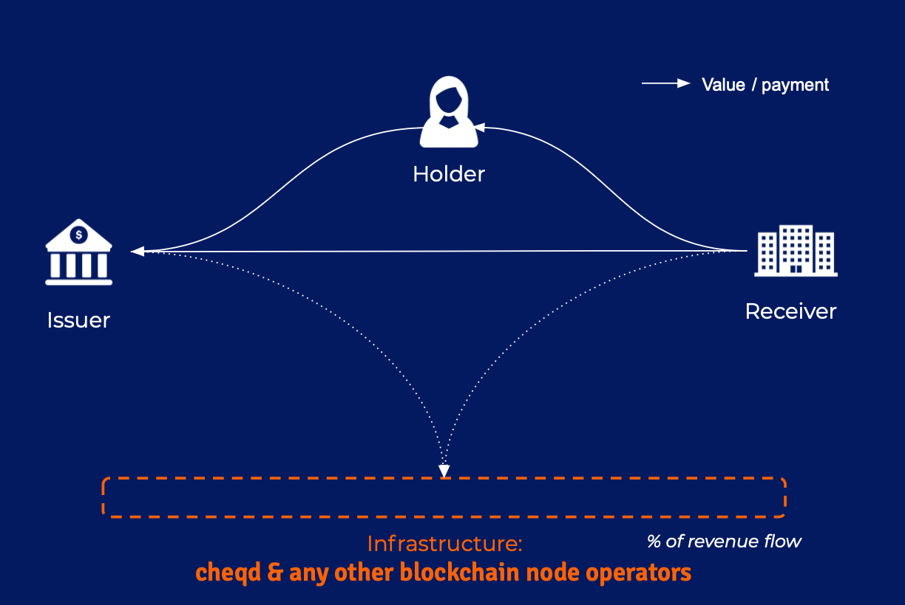

# Introduction to cheqd

## **Objective of cheqd**

**The objective of cheqd is to make authentic data secure, private, commercially sustainable, accessible, and inclusive through the use of a token.** 

**Okay, but what does this actually mean?** 

Let's start by discussing digital identity. ****

Digital identity is something that we rarely think about in our day-to-day lives, but it is something that we all have subscribed to. 

**Let's take a simple example.**

Every time we open an account online, buy something online, use social media, or even just browse the internet, we are creating a digital footprint for ourselves, which feeds into a digital profile. 

Over time we accumulate hundreds of these digital profiles.  

**What is the problem with this?**

These digital profiles are generally secured behind a password, meaning that we feel a level of confidence that we have control over them. 

However, in reality this is not the case. Our data is stored across multiple gated siloes, and every time we want to access this data, we need to prove to the gatekeeper that we are who we claim to be through an authentication process.

In other words, every time we want to get access to our own data and digital identity, we need to get through a locked door using a key.

We _****_play out this sequence multiple times a day:

> Person: _**"Hello there, can I please get into my account to view my own data please".**_
>
> Company: "_**Ahhh maybe, if you have the key you can get in, otherwise nah, you can't have your data today".**_
>
> Person: _**\*Digs out key\*     "Password1!   -   an old classic"**_
>
> Company: _**"Come on in then, have a rummage around, and then close the door behind you on the way out, yeah?"**_
>
> Person: _**"Can I maybe have a verified copy of this data, so I can prove who I am to the next company to make this whole process easier??"**_
>
> Company: _**"You what?"**_
>
> Person: _**"Yeah come on mate, I just want to have a portable copy of my data so that I don't need to go through this process all the time."**_
>
> Company: _**"Yeah it doesn't work like that around here. Have a view of your data, enjoy some videos of cute cats, OH... AND HAVE YOU SEEN THIS VIDEO OF A BABY MONKEY RIDING A PIG?"**_
>
> Person: _**"That is some GREAT content, you know what, forget about what I said before yeah, you keep that data and do your thing"**_
>
> Company: _**\*sweats advertisement money\***_

This is the digital sphere we have all become accustomed to, without really being aware of, or presented an alternative. For this reason, we feel a level of content sacrificing a little bit of privacy for a whole lot of convenience. 

Recently, this model has led to two further issues:

### **1. Convenience becomes inconvenient:** 

As we get more and more accounts, remembering and managing passwords becomes increasingly difficult. Too many times we are faced with a popup, saying something along the lines of “Hold up, before you access this service we need to ask you some questions to verify that you are who you claim to be.”   
  
And because its getting more difficult to manage, we end up using the same key to access multiple accounts, which leaves the door open for scammers, hackers and fraudsters to easily phish the key away and obtain our digital assets. 

This constant battle to access one’s own accounts and data is frustrating. And we believe that it’s outdated. 

### **2. Lack of trust online has become normalised:** 

If you are asked to prove who you are to someone online, there is no existing way of doing this. Whilst in the physical world we have verifiable documents such as passports and driving licenses which contain trusted, safety features, in the digital world we have nothing of the sort. 

If I meet someone on social media, an eCommerce platform or a dating website, I have no simple way to verify that the person is who they claim to be. Why is this the case? Even though I have hundreds of accounts online, and many of them even require a ‘Know Your Customer’ procedure, I never hold that verified data. Companies hold that verified data... and they monetise it.   

### There is a better way of managing data

Over the last few years, there has been a big push for individuals to have greater control, autonomy and sovereignty over their own data. 

Instead of companies managing data indirectly, on your behalf, it is now possible to hold your own data securely in a digital wallet. 

**This type of technology has been labelled by the industry as decentralised, or Self-Sovereign Identity \(SSI\).**

SSI works by attaching a layer of trust to data. 

Companies can ‘issue’ data directly which has been cryptographically signed to an individual, instead of only holding it in data siloes. 

This signature can be thought of like a watermark or stamp which proves that the data is authentic. 

The individual then holds this signed packet of data \(Verifiable Credential\) within a digital wallet on one of their personal devices.

The individual can then reuse this data to prove attestations of their identity to a third party.

All of the cryptographic signatures exist on a public repository, which can be a blockchain or another trusted utility. 

This enables third-parties to match the signature on the Verifiable Credential against the publicly listed signature \(Public Decentralised Identifier DID\). Creating a trusted interaction without the need for an intermediary.

With SSI, individuals can build up multiple attestations for identity attributes such as their name, their nationality etc. and build a very strong level of assurance in the claim that ‘I am X’ or 'I have X attributes'.

Digital identities give the ability for people to prove who they are in a digital domain using signed proofs. 

**This flips the dynamics of digital identity on its head.** 

Rather than having your data locked behind doors and maintained by gatekeepers, you become the gatekeeper for your own data, and have the choice as to when you share it with third parties. 

This does a few things.

1. **It re-centres control of data around an individual;**
2. **It enables far greater trust in digital interactions;**
3. **It becomes far easier to access new services with bi-directional trust and confidence.**

The value of the technology which enables SSI is also hugely widespread. 

By having authentic data, which is cryptographically signed and resolvable, any process which requires data transfer can become more trusted and more efficient.

For this reason, the use cases of 'SSI' have branched out much further than empowering identity control, to the point where SSI as a term, is now misleading. The term 'authentic data' is far more all-encompassing. 

Authentic data is being used to add trust to:

* \*\*\*\*[**Individuals;**](https://www.iata.org/en/pressroom/pr/2020-12-16-01/)\*\*\*\*
* \*\*\*\*[**Companies;**](https://www.gleif.org/en/lei-solutions/gleifs-digital-strategy-for-the-lei/introducing-the-verifiable-lei-vlei)\*\*\*\*
* \*\*\*\*[**Objects;**](https://lists.w3.org/Archives/Public/public-credentials/2020Jun/0100.html)\*\*\*\*
* \*\*\*\*[**Internet of Things devices.**](https://sovrin.org/library-iot/)\*\*\*\*

And the use cases and projects of this technology are growing rapidly...

## Why does authentic data need a token?

Authentic data undoubtedly has a lot of utility, but currently there is no incentive for companies to issue authentic data.

Arguably, there would be a long term benefit, if Verifiable Credentials became widely circulated; however, the short term benefit is very minimal and ecosystem-specific. 

To accelerate the adoption of authentic data, there must be a financial incentive and this is what the cheqd Network will provide.

cheqd are blending Decentralised Finance and Authentic Data using a token, called the cheq. This token will enable payments to be made directly for verified, authentic data in the form of standardised W3C Verifiable Credentials.  

To support this objective, cheqd has built its own blockchain, using the Cosmos SDK. This is known as the cheqd “Network”. Through this Network, cheqd’s objective is to maximise the incentives for all members of the self-sovereign identity ecosystem \(holders, verifiers, issuers and Node Operators\) to increase participation in the Network \(transaction volume and distinct membership\). 

In simple terms, if the verifier pays a nominal fee for authentic data, then this fee can be distributed via the rest of the ecosystem participants. 

They key tool used to incentivise this behaviour depends on the stakeholder being considered:

1. Holder: Rewarded for participation in ecosystem;
2. Verifier: Reduced cost for verifying / receiving trusted information;
3. Issuer: Recurring revenue stream from issued credentials;
4. Node operators: Rewarded for providing capacity and speedy consensus;
5. Foundation: Rewarded for building new, desired functionality 


**Verifier payment = Payment to holder + payment to issuer + payment to node operators + payment to foundation**


For more information on why a token is needed, [our blog post expands on this here](https://blog.cheqd.io/why-self-sovereign-identity-needs-a-token-46e43dada01d). 

