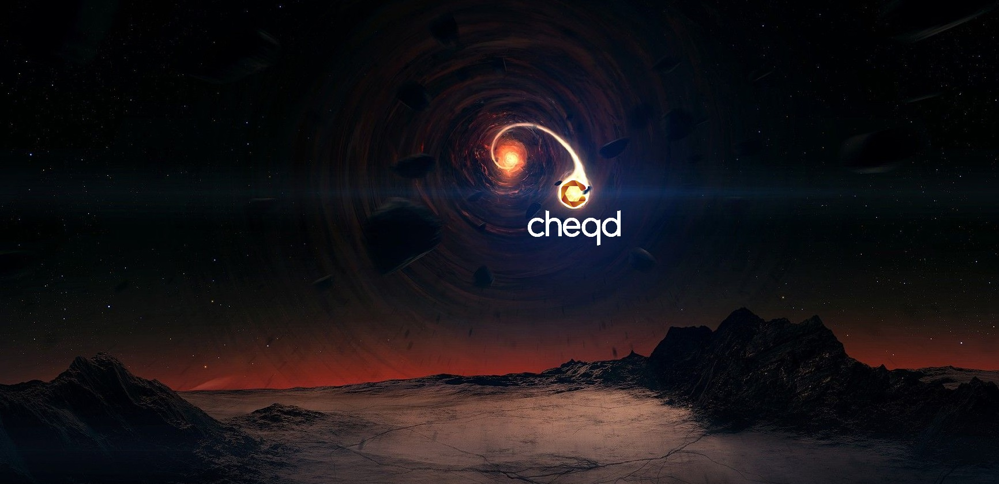
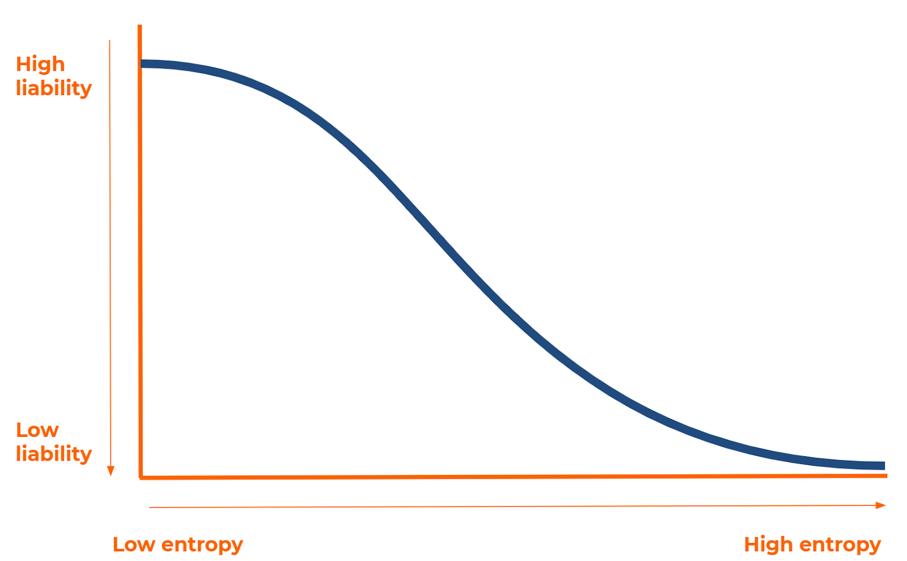

# Introduction to Entropy

## **Introduction** 

The principle concept of **decentralised governance** is that no single person, entity or organisation can control the direction of change in a public Network. Instead, the direction of change is agreed by the democratic votes of an ever-growing, diverse collective.

Through this notion, accountability for decisions on the Network is diluted. And there comes a point where accountability cannot be attributed to a specific person, nor to the entire collective.

A decentralised Network where accountability is spread out as such is known as being **sufficiently decentralised.** This is because the group of entities making decisions on the Network is too difficult to pursue with legal recourse.

This point is desirable to reach, because it enables the Network to function purely as a utility, regulating itself through its own architecture, without having to jump through legal hoops to operate.

However, sufficient decentralisation is something that cannot be reached overnight. There is a transition period between the genesis event of any decentralised Network and the point at which sufficient decentralisation may be claimed.

## **Sufficient Decentralisation** 

The transition from default settings, form, structure, legal accountability and relative centralisation — to sufficient decentralisation, wide-barrel consensus and accountability-dilution is crucial to get right.

This is because the legal standing of what sufficient decentralisation means is currently unclear. And if the Network does not reach sufficient decentralisation, the creators of the Network or majority stakeholders may face compliance issues across multiple jurisdictions.

William Hinman, the Director of Corporate Finance at the Securities and Exchange Commission \(SEC\) explained his notion of sufficient decentralisation at a Finance summit in 2018, stating:

> _“If a network on which the token or coin is to function is **sufficiently decentralized** — where **purchasers would no longer reasonably expect a person or group to carry out essential managerial or entrepreneurial efforts** — the assets may not represent an investment contract. Moreover, when the efforts of the third party are no longer a key factor for determining the enterprise’s success, material information asymmetries recede. **As a network becomes truly decentralized, the ability to identify an issuer or promoter to make the requisite disclosures becomes difficult, and less meaningful**.”_

Hinman also later describes Ethereum and Bitcoin as both being sufficiently decentralised because an “unaffiliated, dispersed community of network users”, perform essential tasks on the respective networks.

This is particularly interesting when compared to Ripple, another cryptocurrency, who are currently facing a legal battle with the SEC in the USA.

The SEC has currently labelled Ripple as an unregistered security, contradicting US securities law because it is not sufficiently decentralised. SEC’s rationale is based on the degree of control which Ripple, a limited company, has over the coin they created, XRP.

The lines certainly are not black and white, and an updated legal opinion, “the Ripple Test”, will likely come out later this year.

However, when comparing Ripple to Ethereum and Bitcoin we can isolate a number of differentiating points to qualify sufficient decentralisation.

1. **Locus of control:** Ripple is a private company with a vested interest in the Network, it owns over 50% of the total supply of coins and can choose how it governs this treasury.
2. **Pulling the strings:** Ripple handpicked a large proportion of the 33 nodes on the ‘Unique Nodes List’ which finalise transactions on XRP. As such, although Ripple itself does not determine the votes of these nodes; it has curated a Network which it wants.

At cheqd we have looked at the situation Ripple is going through with the SEC, and of course, we don’t want to make the same mistakes.

We want cheqd to achieve sufficient decentralisation, and to dissolve the initial control over the Network that few stakeholders may have. We want decisions to be made by the Network, and not by ourselves.

This is why we have created the concept of **Entropy** to transparently and effectively achieve sufficient decentralisation, through **decentralised governance.**

## **Entropy** 

Entropy is broadly defined as the degree of disorder or uncertainty in a system or process of degradation or a trend to disorder, according to the [Mirriam-Webster Dictionary](https://www.merriam-webster.com/dictionary/entropy). In Physics, and specifically, the Second Law of Thermodynamics, and its function is best explained through a metaphor succinctly delivered by [Brian Cox](https://www.bbc.co.uk/programmes/p00fflcs).

Let’s think of a sandcastle sitting in a desert.

The sandcastle in the desert has both order and structure, and there are very few ways to arrange the sand grains to achieve the same structure.

Nearly anything done to the sandcastle will remove some of the order and structure of the sandcastle, gradually eroding the sand away from the familiar and notable structure.

For this reason, the sandcastle can be said to have **Low Entropy** because it relies on order, structure and design.

Conversely, a pile of sand with roughly the same amount of sand grains as the sandcastle has immeasurably more ways of ordering the sand to look like a pile of sand. This is due to the relative disorder of the sand pile.

For this reason, the pile of sand, with many more ways to arrange it, has **High Entropy.**

Now imagine that the sandcastle was left in the desert all day. The winds in the desert would blow the sand around, and it would slowly disintegrate and fall to bits.

However, there is nothing fundamental in the laws of physics that says that the wind could not pick up some sand from a pile and deposit it in precisely, the exact shape of a sandcastle.

It is just extremely, extremely unlikely because there are very few ways of ordering the sand so it looks like a sandcastle.

It is overwhelmingly more likely that the wind will **take the Low Entropy structure**, the sandcastle, and **turn it into a High Entropy structure**, the sand pile.

In short, physics says that **Entropy always increases**.

This same pattern and natural law can be seen in the development of decentralised governance. And if modelled correctly, a decentralised Network can be created so that Entropy always increases, gradually making the Network more and more decentralised.

**The increasing of Entropy is one of cheqd’s foundational Principles, and we believe we can use it as a tool to achieve sufficient decentralisation efficiently and with transparency.**

## **The genesis event** 

Like a perfectly formed sandcastle with Low Entropy, any decentralised ecosystem must begin with a structure, set of rules, parameters and default settings which govern the scope, boundaries and objectives of the Network — usually set by a small group of individuals.

For this reason every decentralised Network begins with a **Low Entropy genesis event** from which point Entropy increases.

This can be thought of like **a Big Bang**, starting a new system with a set of fundamental rules and boundaries.

Even the most high profile blockchains such as [Bitcoin](https://bitcoin.org/) began with a notorious **‘genesis block**’. Also known as Block 0, the Bitcoin genesis block was the first block created on the Bitcoin ledger, and every single Bitcoin block can have its lineage and ancestry traced back to it.

Interestingly, the next block, known as Block 1, wasn’t mined until six days after the Genesis Block. This is considered as a very strange occurrence for the protocol, since the general time gap between blocks is intended to be ~10 minutes.

Many have questioned why Satoshi Nakamoto, the infamous pseudonymous creator of Bitcoin, caused the delay. The most likely theory is that Nakamoto spent the first 6 days testing the protocol and its stability, before backdating the timestamp.

Others believe that Nakamoto wanted to play God and recreate the story of the world being created in six days… Just like the Big Bang, Nakamoto had to create a set of default settings and parameters for Bitcoin to develop autonomously.

The point of this elaboration, however, is to highlight that for every Network that eventually reaches a point of sufficient decentralisation and High Entropy, there is a Big Bang event, and a period of tinkering and adjustment, as Low Entropy begins to increase.

And this is where we start at **cheqd**.

cheqd are defining a set of baseline conditions and rules for the cheqd Network, using Cosmos’ inbuilt decentralised governance capabilities.

And we want to clearly lay out how the Network will enable a smooth transition from a Low Entropy genesis event to a High Entropy, sufficiently decentralised structure.

We will be publishing these default parameters and our roadmap for this journey in our Governance Framework, appearing on our GitHub shortly, stay tuned!

## **How do we calculate Entropy?** 

Entropy is a composite function of a number of different factors, consisting of the number of validators, the number of Users with staked tokens, the number of accepted proposals, the diversity of validators and capacity for a Network overhaul by a proportion of the Network validators.

At a high level, without calculating Entropy mathematically, it can be visualised as having an inverse relationship with liability. At the genesis state, the liability on those with control over the Network will be relatively high. This will quickly tend downwards as the Network expands and decision-making is disseminated among a collective.

Given the legal grey area around the point of sufficient decentralisation, we are setting a high threshold of decentralisation which we want to achieve.

On a visual level, this can be shown as follows.

Through such delineation, we believe that we are positioning ourselves sensibly for any updated legal opinion on the topic.

## **Future proofing cheqd** 

As explained in above, Entropy is such an important concept in this context because it ties directly into liability and to the legal classification of tokens.

As seen with Ripple, it is possible for Networks to be partially decentralised but still retain a controlling stake or pulling power in the Network.

By introducing Entropy, we are removing the surface area for Regulators to scrutinise cheqd in the same way as Ripple.

Future proofing cheqd as a Network and a utility.

In turn, we hope that this gives greater confidence to our Node Operators, token holders and community in the strength of the token.

## **Greater clarity in a grey area** 

To date, the concept of Entropy is something which has been spoken about in roundabout ways across [legal](https://www.sec.gov/news/speech/speech-hinman-061418), [journalistic](https://cointelegraph.com/news/the-word-decentralized-has-lost-all-meaning-enough-is-enough) and [academic mediums](https://arxiv.org/pdf/2101.10699.pdf) in the context of decentralised governance.

Coining the term and the parameters which play into the increase of Entropy will be something that will help decentralised governance architectures achieve legal clarity going forward.

Of course, our definition of Entropy does not have legal standing or significance, but we hope it can be used as a tool or reference point by regulators or at least a sensible classification model.

